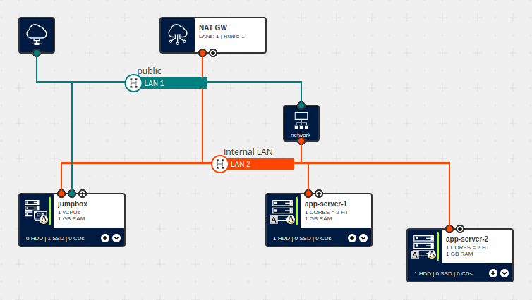

# 6. Introduction to the NAT Gateway and Network Load Balancer


In this installment, we introduce our first 'non-VM' resources: the [NAT Gateway](https://docs.ionos.com/cloud/managed-services/nat-gateway/overview) and the [Network Load Balancer](https://docs.ionos.com/cloud/managed-services/network-load-balancer/outline) (NLB). The former uses [Source NAT](https://en.wikipedia.org/wiki/Network_address_translation#SNAT) to provide a simple way for for VMs without a _direct_ Internet connection to reach public sites and endpoints — something that wasn't possible, e.g., in Part 3 of this series; the latter effectively uses [Destination NAT](https://en.wikipedia.org/wiki/Network_address_translation#DNAT) to provide a relatively 'out-of-the-box' way to acheive _Layer 4_ load-balancing and/or redundancy. Their corresponding entries in our Ansible Module's documentation can be found [here](https://docs.ionos.com/ansible/api/nat-gateway/nat_gateway) and [here](https://docs.ionos.com/ansible/api/network-load-balancer/network_load_balancer), respectively.

Please note that, as both the NAT Gateway _and_ the NLB require their own reserved IP address, your will need to be able to reserve at least two IP addresses (you can see you how many 'reserved IP addresses' your contract is currently using and still able to reerve in the DCD under [Profile Icon] --> Resource Overview). 

> **Also note:** From [docs.ionos.com/cloud/managed-services/network-load-balancer](https://docs.ionos.com/cloud/managed-services/network-load-balancer/outline#limitations):
>
> SNAT Support: Managed NLB is _not_ configured to support Source NAT (SNAT); targets cannot initiate network connections through the load balancer.
>
> NLB operates at TCP/IP layer 4 of the Open Systems Interconnection (OSI) model. NLB will distribute any TCP-based network traffic, including upper application layer protocols, such as HTTP and HTTPS. However, rules and health checks are strictly TCP-based, which means that HTTP rules (e.g., routing decisions based on the URL) are not supported.


## What's in this example?
This example consists of the following files:

| File                                   | Description                                                                                            |
| ---                                    | ---                                                                                                    |
| `01__create_jumpbox_and_nat_gw.yml`    | This playbook builds upon the Cube-related code from Example 3, by adding the necessary calls to reserve an IP address block and create a NAT Gateway with its associated rule    |
| `02__create_app_servers_and_nlb.yml`   | After retrieving the necessary information via the Cloud API, this playbook provisions one or more 'application servers' and an NLB, along with two rules that will forward incoming `ssh` and `http` requests to said servers in a round-robin fashion. (And whilst it's hardly ground-breaking, this playbook also shows how one might provision multiple 'sister-VMs' given a minimal list of configuration options, too)    |
| `03__configure_app_servers.yml`        | This playbook runs on the app servers themselves to (amongst other things) install the NGINX web server and custom, host-specific `index.html` files (which, in turn, show which server you've reached)   |
| `04__clean_up.yml`                     | This playbook cleans up all of the resources provisioned in the previous parts, and should be run once you're done with the earlier parts    |
| `vars.yml`                            | This file contains the variable definitions common to all of this example's individual playbooks    |
| `../vars.yml`                         | This file is common to all of our Ansible examples and contains a set of more generally-used variable definitions     |


More concretely, this example introduces the following IONOS Cloud modules:

1. `ionoscloudsdk.ionoscloud.ipblock`
2. `ionoscloudsdk.ionoscloud.nat_gateway` and `nat_gateway_rule`
3. `ionoscloudsdk.ionoscloud.network_load_balancer` and `network_load_balancer_rule`

whilst also showing how one can dynamically create a _list of objects_ given a pre-existing list (see the three `set_fact` tasks beginning with the one which defines `target_ips` in `02__create_app_servers_and_nlb.yml`).


## Usage
> **Note:** As with all other 'executable' examples in this repository, an 'End User Licence Agreement'-like statement will be displayed, which must also be accepted before the tasks proper can be executed.
>
> Please note that, while potentially quite minimal, you will incur charges for the resources based upon how long you keep them provisioned; for more information on the actual costs, you can follow the links displayed in the 'EULA' text. Also note that, if you run the following through to completion, the playbook should 'clean up' after itself, but we recommend you verify this, e.g., via the DCD or `ionosctl` to make sure you won't be charged for any unwanted resources.

1. To provision the jumpbox and NAT Gateway, run the following command:
   ```
   ansible-playbook 01__create_jumpbox_and_nat_gw.yml
   ```
2. To provision the application servers and the NLB, run the following command:
   ```
   ansible-playbook 02__create_app_servers_and_nlb.yml
   ```
3. To _configure_ the application servers that were provisioned in Step 2, run:
   ```
   ansible-playbook -i inventory.yml 03__configure_app_servers.yml
   ```
4. Optionally, examine the resources that were provisioned in Steps 1 and 2
5. Execute the following to delete the resources provisioned in the previous steps:
   ```
   ansible-playbook 04__clean_up.yml
   ```


Between Steps 3 and 5, you can also run the following commands to access the various resources, directly and via the load balancer:

| Command                               | Description                                                                                            |
| ---                                   | ---                                                                                                    |
| `ssh -F ssh_config ${TARGET_HOST}`    | ssh into the specified server, where `${TARGET_HOST}` is one of `jumpbox`, `app-server-1` or `app-server-2`    |
| `ssh -F ssh_config nlb`               | ssh into _one_ of the app servers via the load balancer (in a round-robin fashion); to see, e.g., the internal servers' IP addresses, you could append `ip addr` to the 'base command'   |
| `curl http://${NLB_ADDRESS}`          | retrieve the `index.html` file from one of the app servers via the load balancer, where `${NLB_ADDRESS}` is the public IP address assigned to the NLB (visible either, e.g., via `ionosctl ipblock list` or the DCD, or in the `ssh_config` file) |


## Summary
In this tutorial, we saw examples of:

1. how to use the `ionoscloudsdk.ionoscloud.ipblock` module to reserve an IP address block;
2. how the `ionoscloudsdk.ionoscloud.nat_gateway` and `nat_gateway_rule` modules can be used to provision and configure a NAT Gateway;
3. how the `ionoscloudsdk.ionoscloud.network_load_balancer` and `network_load_balancer_rule` modules can be used to provision and configure an NLB; and
4. how we can verify that an NLB with a round-robin policy is forwarding incoming connections as expected.
