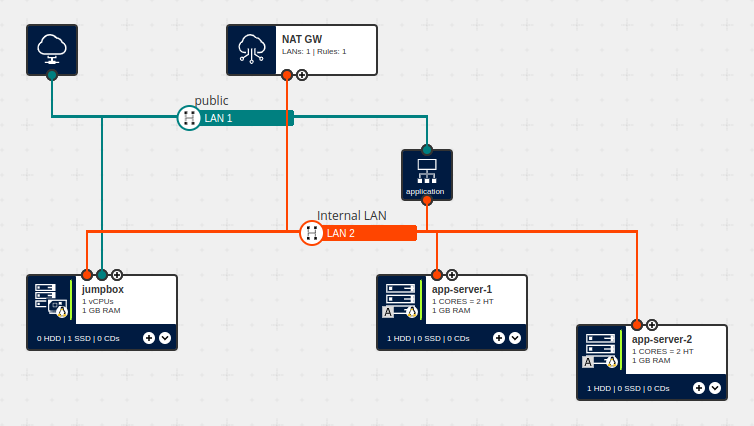

# 7. Introduction to the Application Load Balancer


This installment is based largely upon the last, but instead of provisioning a Network Load Balancer, we introduce the Layer-4 [Application Load Balancer](https://docs.ionos.com/cloud/managed-services/application-load-balancer/overview) (ALB), and its associated [Target Groups](https://docs.ionos.com/cloud/managed-services/application-load-balancer/how-tos/create-target-groups) and [Forwarding Rules](https://docs.ionos.com/cloud/managed-services/application-load-balancer/how-tos/setup-alb#adding-forwarding-rules) structures. (Their corresponding entries in our Ansible Module's documentation can be found [here](https://docs.ionos.com/ansible/api/application-load-balancer/application_load_balancer), [here](https://docs.ionos.com/ansible/api/application-load-balancer/target_group) and [here](https://docs.ionos.com/ansible/api/application-load-balancer/application-load-balancer-rule), respectively.)

Please note that, as both the NAT Gateway _and_ the ALB require their own reserved IP address, your will need to be able to reserve at least two IP addresses (you can see how many 'reserved IP addresses' your contract is currently using and still able to reserve in the DCD under [Profile Icon] --> Resource Overview). 

> **Also note:** From [docs.ionos.com/cloud/early-access/application-load-balancer](https://docs.ionos.com/cloud/early-access/application-load-balancer/overview#docs-internal-guid-ed9f1857-7fff-b61e-c4da-43e1453073cc):
>
> The ALB is _not_ configured to support Source NAT (SNAT). Therefore, targets cannot initiate network connections through the load balancer.
>
> Each Application Load Balancer must have at least one Listener and supports up to 10 Listeners.


## What's in this Example?
This example consists of the following files:

| File                                   | Description                                                                                            |
| ---                                    | ---                                                                                                    |
| `01__create_jumpbox_and_nat_gw.yml`    | This playbook reserves an IP address block and creates a Cubes-based jumpbox and NAT Gateway (as per Example 6)    |
| `02__create_app_servers_and_alb.yml`   | After retrieving the necessary information via the Cloud API, this playbook provisions one or more 'application servers' and an ALB, along with a rule that will forward incoming `http` requests to said servers in a round-robin fashion    |
| `03__configure_app_servers.yml`        | This playbook runs on the app servers themselves to (amongst other things) install the NGINX web server and custom, host-specific `index.html` files (which, in turn, show which server you've reached)   |
| `04__clean_up.yml`                     | This playbook cleans up all of the resources provisioned in the previous parts, and should be run once you're done with the earlier parts    |
| `vars.yml`                            | This file contains the variable definitions common to all of this example's individual playbooks    |
| `../vars.yml`                         | This file is common to all of our Ansible examples and contains a set of more generally-used variable definitions     |


## Usage
> **Note:** As with all other 'executable' examples in this repository, an 'End User Licence Agreement'-like statement will be displayed, which must also be accepted before the tasks proper can be executed.
>
> Please note that, while potentially quite minimal, you will incur charges for the resources based upon how long you keep them provisioned; for more information on the actual costs, you can follow the links displayed in the 'EULA' text. Also note that, if you run the following through to completion, the playbook should 'clean up' after itself, but we recommend you verify this, e.g., via the DCD or `ionosctl` to make sure you won't be charged for any unwanted resources.


1. To provision the jumpbox and NAT Gateway, run the following command:
   ```
   ansible-playbook 01__create_jumpbox_and_nat_gw.yml
   ```
2. To provision the application servers and the ALB, run the following command:
   ```
   ansible-playbook 02__create_app_servers_and_alb.yml
   ```
3. To _configure_ the application servers that were provisioned in Step 2, run:
   ```
   ansible-playbook -i inventory.yml 03__configure_app_servers.yml
   ```
4. Optionally, examine the resources that were provisioned in Steps 1 and 2
5. Execute the following to delete the resources provisioned in the previous steps:
   ```
   ansible-playbook 04__clean_up.yml
   ```


Between Steps 3 and 5, you can also run the following commands to access the various resources, directly and via the load balancer:

| Command                               | Description                                                                                            |
| ---                                   | ---                                                                                                    |
| `ssh -F ssh_config ${TARGET_HOST}`    | ssh into the specified server, where `${TARGET_HOST}` is one of `jumpbox`, `app-server-1` or `app-server-2`    |
| `curl http://${ALB_ADDRESS}`          | retrieve the `index.html` file from one of the app servers via the load balancer, where `${ALB_ADDRESS}` is the public IP address assigned to the ALB (visible either, e.g., via `ionosctl ipblock list` or the DCD, or in the `ssh_config` file)   |


### Troubleshooting tips
- If you get a `name 'certificate_manager_sdk_version' is not defined` error message when working with the Application Load Balancer, make sure you have the appropriate module installed (this can be done by running the command `pip install ionoscloud-cert-manager`)
- Due to the way in which browsers tend to keep their TCP connections open for a period of time, you might need to wait for these connections to time out _before_ reloading this URL (otherwise the ALB will connect you with the same internal server)...


## Summary
In this tutorial, we saw examples of:

1. how the `ionoscloudsdk.ionoscloud.application_load_balancer`, `target_group` and `application_load_balancer_forwardingrule` modules can be used to provision and configure an ALB; and
2. how we can verify that the ALB is forwarding incoming connections as expected (and how its behaviour differs from the _NLB_)
