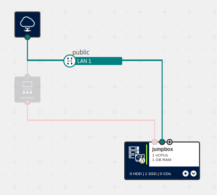

# 9. A Quick Introduction to DBaaS


In this, one of our last examples, we introduce two Managed Database / DBaaS products: [PostgreSQL](https://docs.ionos.com/cloud/managed-services/database-as-a-service/postgresql) and [MongoDB](https://docs.ionos.com/cloud/managed-services/database-as-a-service/mongodb) (their corresponding entries in our Ansible Module's documentation can be found [here](https://docs.ionos.com/ansible/api/dbaas-postgres/postgres_cluster) and [here](https://docs.ionos.com/ansible/api/dbaas-mongo/mongo_cluster), respectively).

In addition to creating one or both of the aforementioned DBaaS clusters, we will also create an SSH jumpbox that can be used to access the database clusters from 'the Internet'; given that, for security reasons, our DBaaS products are configured, out of the box, to only allow connections from private LANs within the virtual data center specified at their time of creation, this technique may come in handy for remote development and/or database administration tasks. (This example also comes with a minimal set of PostgreSQL and MongoDB client tools which can be used to connect _directly_ to the newly-provisioned database clusters.)

> **Note:** While there are several good reasons why one really _shouldn't_ expose a database cluster to the Internet directly, if you _really_ want to, you can set the variable `ENABLE_EXPLICITLY_UNSUPPORTED_CONFIGURATIONS` in `vars.yml` to true before running the playbooks in this example... This will then create a Network Load Balancer (NLB), together with the rules required to forward PostgreSQL and MongoDB client connections through to their respective clusters.
>
> **Also note:** unlike the cases where access is mediated via SSH port-forwarding or an actual router- / firewall-appliance, it is _not_ possible to restrict access to these ports to specific IP addresses or subnets when using an NLB — i.e. if you enable this feature, you will literally be exposing your database cluster(s) to anyone who happens to discover them during a port scan.


## What's in this example?
This example consists of the following files:

| File                                   | Description                                                                                            |
| ---                                    | ---                                                                                                    |
| `01__create_jumpbox_and_nlb.yml`       | This playbook provisions a Cube-based jumpbox, before installing PostgreSQL and MongoDB clients on it. (If `ENABLE_EXPLICITLY_UNSUPPORTED_CONFIGURATIONS==true`, it will also create and configure a Network Load balancer, as described above.)    |
| `02a__create_postgres_cluster.yml`     | This playbook creates a PostgreSQL cluster; the `dbadmin` user's default password is the same as the one defined in `../vars.yml`    |
| `02b__create_mongodb_cluster.yml`      | This playbook creates a MongoDB cluster; the `dbadmin` user's default password is the same as the one defined in `../vars.yml`    |
| `03__clean_up.yml`                     | This playbook deletes any DBaaS clusters that were provisioned by the previous playbooks, and then removes the remaining resources, including the IP address block that was reserved in Part 1     |
| `vars.yml`                             | This file contains the variable definitions common to all of this example's individual playbooks    |
| `../vars.yml`                          | This file is common to all of our Ansible examples and contains a set of more generally-used variable definitions     |


More concretely, this example introduces the following IONOS Cloud modules:

1. `ionoscloudsdk.ionoscloud.postgres_cluster`
2. `ionoscloudsdk.ionoscloud.mongo_cluster` and `mongo_cluster_user`

It also shows how a host can be added dynamically to the inventory (search for `ansible.builtin.add_host` in `01__create_jumpbox_and_nlb.yml`) — an alternative to generating an `inventory.yml` file and applying it to a separate / standalone playbook.


## Usage
> **Note:** As with all other 'executable' examples in this repository, an 'End User Licence Agreement'-like statement will be displayed, which must also be accepted before the tasks proper can be executed.
>
> Please note that, while potentially quite minimal, you will incur charges for the resources based upon how long you keep them provisioned; for more information on the actual costs, you can follow the links displayed in the 'EULA' text. Also note that, if you run the following through to completion, the playbook should 'clean up' after itself, but we recommend you verify this, e.g., via the DCD or `ionosctl` to make sure you won't be charged for any unwanted resources.


1. To provision the jumpbox and the NLB, run the following command:
   ```
   ansible-playbook 01__create_jumpbox_and_nlb.yml
   ```
2. To provision one or both DBaaS clusters, run one or both of the following commands:
   ```
   ansible-playbook 02a__create_postgres_cluster.yml
   ansible-playbook 02b__create_mongodb_cluster.yml
   ```
   Note that these playbooks can be provisioned independently of each other, and that after each of them are run, they will also give you specific examples of how to connect to your newly-provisioned database clusters (see below).
3. Execute the following to delete the resources provisioned in the previous steps:
   ```
   ansible-playbook 03__clean_up.yml
   ```

Between Steps 2 and 3, you can also run the commands output at the end of the 'create cluster' playbooks to connect to your newly-provisioned database cluster. E.g. after running `ansible-playbook 02a__create_postgres_cluster.yml` with `ENABLE_EXPLICITLY_UNSUPPORTED_CONFIGURATIONS` set to `true`, you will see something of the form:

```
TASK [Print usage information] *******************************************************************************************************************************
ok: [localhost] => {
    "msg": [
        "To access your Postgres Cluster via, e.g., psql, use one of the following commands:",
        "    From the jumpbox:",
        "        psql -h 192.168.8.16 -U dbadmin postgres",
        "    Externally via the jumpbox:",
        "        In one shell:     ssh -L 5432:pg-pi567l15bgolgtkt.postgresql.de-txl.ionos.com:5432 root@W.X.Y.Z_0",
        "        In another shell: psql -h localhost -U dbadmin postgres",
        "    Externally via the NLB:",
        "        psql -h W.X.Y.Z_1 -U dbadmin postgres"
    ]
}
```


## Summary
In this tutorial, we saw examples of:

1. how the `ionoscloudsdk.ionoscloud.postgres_cluster`, `ionoscloudsdk.ionoscloud.mongo_cluster` and `mongo_cluster_user` modules can be used to provision Postgres and MongoDB database clusters;
2. how hosts can be added dynamically to the inventory, as an alternative to generating an `inventory.yml` file and using it with a separate / standalone playbook; and
3. how we can connect to said database clusters, both via a common, private LAN; via a jumpbox using an SSH key-pair; and optionally, via an open form of port-forwarding.
